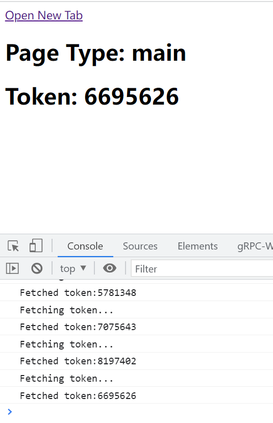
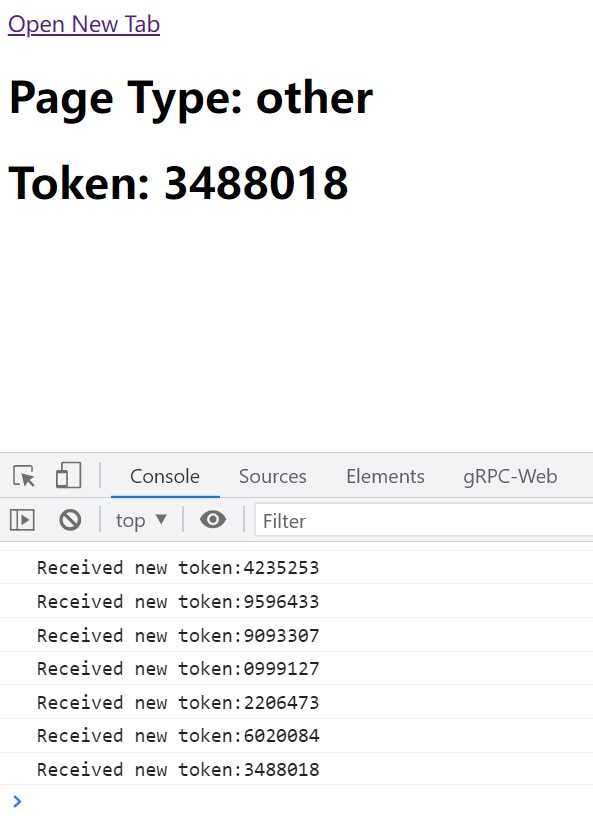

# Share Token Among Tabs
This repository demos how to share tokens among several browser tabs. 
1. It depends on localstoage to save and share the tokens.
2. It leverages change event of storage to get notification from other tabs.
3. It designes a simpfily mechinsm to vote a main tab that respond to refresh the token periodly. 

# Getting Started
It's(The `public` folder) static site so that it could be hosted by any http server such as `Apache httpd`, `Nginx`, etc.

Let's say it was hosted on `localhost:3000`, when it's opened in the browser. You will see that the tab has a random id as the document title. And there are also the `main` or `other` label to indicate if this is the main page. The `main page` responsible for cliaiming new tokens once needed(just periodly for demo).

Then you open a new tab. If the id of tab less than the main tab, the new tab is now a `other` page. The `other page` just receive token updates from storage.

If the main page was closed, the other page will be selected as the main page. 

# LICENSE
MIT